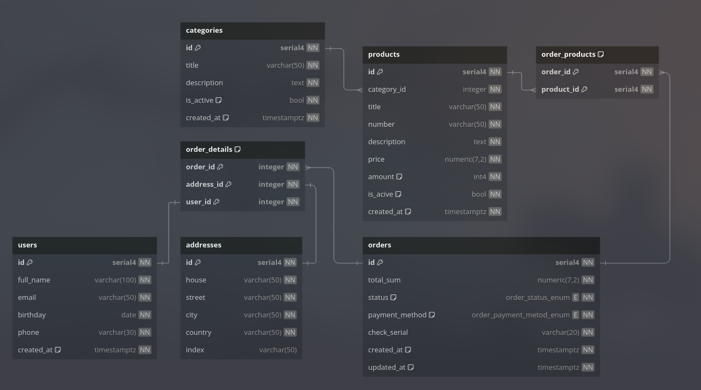

## Diagram



## Code
```
Enum order_status_enum {
  "CREATED"
  "IN_PROGRESS"
  "TRANSIT"
  "DELIVERED"
  "CANCELED"
}

Enum order_payment_metod_enum {
    "UPON_RECEIPT"
    "AFTER_FITTING"
    "IN_ADVANCE"
    "INSTALLMENTS"
    "UPON_DELIVERY"
    "AFTER_VERIFICATION"
}

Table "public"."categories" {
  "id" serial4 [pk, not null, ref: < public.products.category_id]
  "title" varchar(50) [not null]
  "description" text [not null]
  "is_active" bool [not null, default: False]
  "created_at" timestamp [not null, default: 'CURRENT_TIMESTAMP'] 

}

Table "public"."orders" {
  "id" serial4 [pk, not null, ref: < public.order_products.order_id, ref: < public.order_details.order_id]
  "total_sum" numeric(7, 2) [not null]
  "status" order_status_enum [not null]
  "payment_method" order_payment_metod_enum [not null]
  "check_serial" varchar(20) [not null, unique]
  "created_at" timestamp [not null, default: 'CURRENT_TIMESTAMP'] 
  "updated_at" timestamp [not null, default: 'CURRENT_TIMESTAMP']
}

Table "public"."order_details" {
  "order_id" integer [pk, not null]
  "address_id" integer [pk, not null]
  "user_id" integer [pk, not null]
}

Table "public"."products" {
  "id" serial4 [pk, not null, ref: < public.order_products.product_id]
  "category_id" integer [not null]
  "title" varchar(50) [not null]
  "number" varchar(50) [not null]
  "description" text [not null]
  "price" numeric(7,2) [not null]
  "amount" int4 [not null, default: 0]
  "is_acive" bool [not null, default: False]
  "created_at" timestamp [not null, default: 'CURRENT_TIMESTAMP'] 
}

Table "public"."users" {
  "id" serial4 [pk, not null, ref: - public.order_details.user_id]
  "full_name" varchar(100) [not null]
  "email" varchar(50) [not null, unique]
  "birthday" date [not null] 
  "phone" varchar(30) [not null]
  "created_at" timestamp [not null, default: "CURRENT_TIMESTAMP"]
}

Table "public"."addresses" {
  "id" serial4 [pk, not null, ref: - public.order_details.address_id]
  "flat" varchar(50) [null]
  "house" varchar(50) [not null]
  "street" varchar(50) [not null]
  "city" varchar(50) [not null]
  "country" varchar(50) [not null]
  "index" varchar(50) [null]
}

Table "public"."order_products" {
  "order_id" serial4 [pk, not null]
  "product_id" serial4 [pk, not null]
}
```